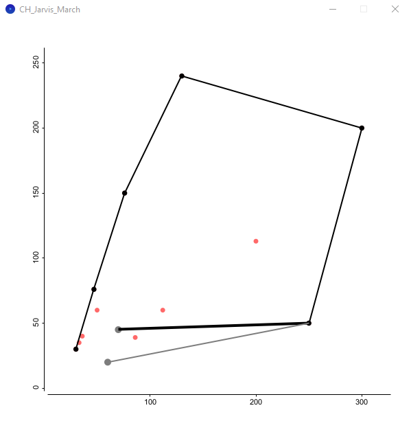
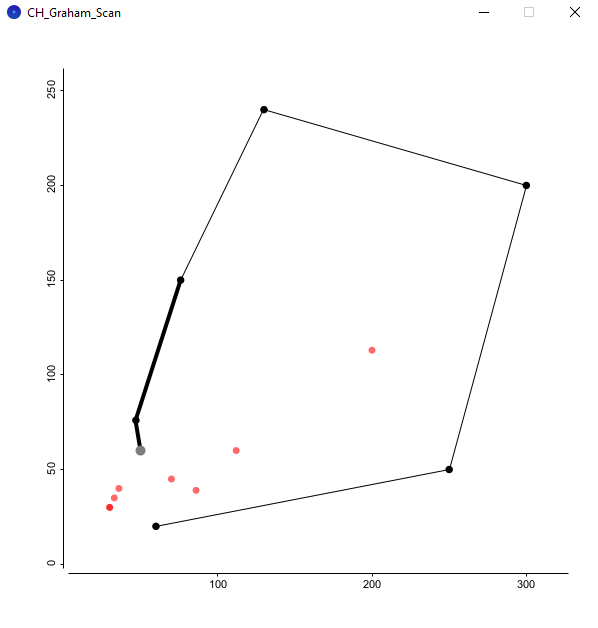
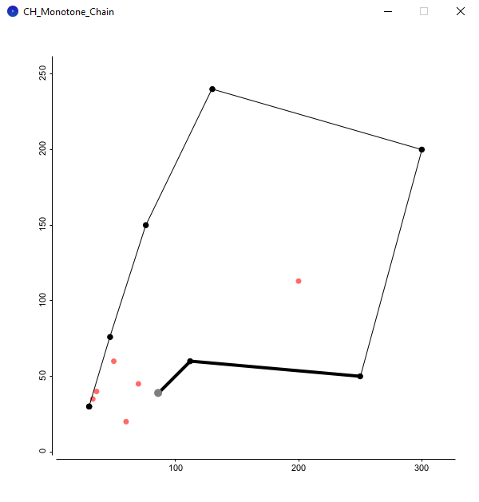

# Convex Hull Visualizer

Step-by-step visualizer of three Convex Hull algorithms using Processing and the plotting library grafica: Jarvis March, Graham Scan and Monotone Chain. Developed as part of the Computational Geometry course at University of Guanajuato.

## Demo

## Algorithms

Suppose we wish to find the convex hull of a set of two-dimensional points `P[1, 2, ..., n]`.

### Jarvis March

The first of the implemented algorithms is the [Jarivs March algorithm](https://en.wikipedia.org/wiki/Gift_wrapping_algorithm), also known as the Gift Wrapping algorithm. The main idea of this algorithm is the following: when a new point $p$ is added to the convex hull, all points in `P` are scanned in order to find the next point in the hull, taking the one with greatest polar angle. The algorithm goes as follows:

1. Add the leftmost point of `P` to the convex hull (`CH`). Set `i := 1`.
2. Scan all points `P[1]`, `P[2]`, ..., `P[n]`to find the one with greatest polar angle respect to `CH[i]` (the last added point on the CH). Call such point `P[j]`.
3. If `P[j] == CH[1]`, the CH has closed and the algorithm halts.
4. Else, add `P[j]` to the CH: set `CH[i+1] = P[j]`, increment `i = i + 1`, and go back to step 2. 

Notice how to find the next point in the convex hull we must scan all $n$ points. Hence, the time complexity for this algorithm is $O(nh)$, where $h$ is the number of points in the resulting convex hull.

### Graham Scan

The second algorithm is the [Graham Scan algorithm](https://en.wikipedia.org/wiki/Graham_scan), which main idea is to sort all $n$ points according to their polar angle with the lowest point on `P` and iterate over all points, forming the convex hull. The algorithm goes as follows:

1. Make `P[1]` the point of lowest $y$-coordinate and leftmost point on $P$.
2. Sort `P` according to their polar angles with `P[1]`.
3. Let `CH` be an initially empty stack of points. For `i = 1, 2, ..., n` do step 4 and 5:
4. While `CH` contains at least two points and `next_to_top(CH)`, `top(CH)` and `P[i]` perform a clockwise turn, do `pop(CH)`. That is, delete the last point on the stack `CH` until the new point `P[i]` forms a counter clockwise turn with the last two points on stack.
5. Push `P[i]` to `CH`.

After this, `CH` will contain the points of the convex hull in counter clockwise order. The time complexity for this algoritmh is $O(n \log n)$, for it requires sorting points according to polar angle and afterwards traversing all points a single time. The complexity of the former part ( $O(n \log n)$ ) dominates the complexity of the latter ( $O(n)$ ), producing the stated time complexity.

### Monotone Chain

The final algorithm is the [Monotone Chain algorithm](https://en.wikibooks.org/wiki/Algorithm_Implementation/Geometry/Convex_hull/Monotone_chain) (also known as Andrew's Algorithm). In this algorithm, the points on `P` are sorted in lexicographical order and traversed twice, forming first the "upper hull" and the "lower hull".

1. Order `P` lexicographically (by $x$-coordinate and untying by $y$-coordinate).
2. Let `U` and `L` be empty stacks (they will eventually store the upper and lower hull, respectively).
3. For `i = 1, 2, ..., n`, do steps 4 and 5.
4. While `U` contains at least two points and `next_to_top(U)`, `top(U)` and `P[i]` perform a counter clockwise turn, do `pop(U)`.
5. Push `P[i]` to `U`.
6. For `i = n, n - 1, ..., 1`, do steps 7 and 8.
7. While `L` contains at least two points and `next_to_top(L)`, `top(L)` and `P[i]` perform a counter clockwise turn, do `pop(L)`.
8. Push `P[i]` to `L`.
9. Do `pop(U)` and `pop(L)` (the last point of one is the first point of the other), and concatenate `U` and `L`, obtaining the convex hull in clockwise order.

The sorting in step 1 has an $O(n \log n)$ time complexity, while the following has $O(n)$, for it is only iterating twice through all points in `P`. Hence, the total time complexity for the Monotone Chain algorithm is $O(n \log n)$.

## Installation and usage

